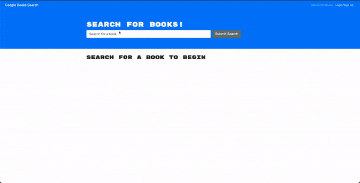

# Google-Books
link: 
  
  - - -
## Description
🔍   React app that uses Google Books API and lets registered users search your favorite books or books you may be intrested in. Search an author or a title you may have in mind. Want to keep track of those books you will have the ability to save your books in My Books.
- - -
## Table of Contents
- [Description](#description)
- [Installation](#installation)
- [Tests](#tests)
- [Questions](#questions)
- - -
## Installation
   | Steps |
 | ----------- |
| clone repository |
| npm install   |
| npm run devlop |
| app will be running on localhost:3000 |

- - -
## Tests

- - -
## Questions
- Alexander Noriega 
- email:  Alexnoriega47@gmail.com